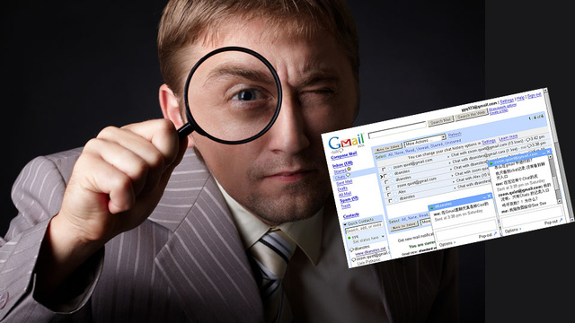

# About QuoteBank
MISSING

# Framing our research

	

In the new technology and social media era we are constantly exposed to politics, and thus political speech. One thing that’s easy to notice is that some politicians have a more refined speech than others. 
One very famous example of this phenomenon struck our attention some time ago in the quiet turbulent context of Italian politics: Porta a Porta, a very famous Italian talk show on politics, hosted a debate between politicians Matteo Renzi and Matteo Salvini. Soon after the beginning of the debate, viewers started noticing the stark difference in the way the politicians talked: Renzi used long sentences, used a varied lexicon while Salvini did the opposite: he used simpler words in a repetitive manner, keeping the phrases more simple than Renzi’s.
Renzi and Salvini are not alone, indeed we found that such differences can be found while considering many other politicians from the two sides of the political spectrum.

<!---  -->

	

# What are we looking for? Research question

Our supposition is that there is a difference in the linguistic usage between the two sides of the political spectrum. We suspect this difference to be found in the 

number of different words while speaking (variety of lexicon)
different length of phrases
number of repetitions
different structuring of the phrases (number of subordinate vs coordinate phrases)

We plan to investigate whether this difference is present in the US political landscape. In other words, is the language that Republicans use much different than those that Democrats use. 

# How do we measure?
Metrics to be used
MISSING

## Examples of metrics
TODO
- Choose text of Trump
- Choose text of Obama
- Apply scripts

# Let's start our investigation...

ONE VS ONE COMPARISON

CLOUDS OF WORDS

FAMOUS POLITICIANS

# Aggregate comparisons

MAP, AGE, PARTY ...

Bla bla
Bla bla

  

Bla bla




Interesting ! The number of views seems to have been impacted by the revelations !

# Snowden's revelations, not the only big news

Bla bla

We gathered those extraordinary events, feel free to explore them.



# Ghouta chemical attack

Let's zoom into a particular example. On the calendar, we see that on the week of the 21 of March 2013, the Wikipedia article 'Chemical Weapon' has a high activity. It makes sense because on this date, there was an attack in Ghouta in Syria, during the civil war. It was the deadliest use of chemical weapon since the Iran-Iraq war. This event is about news in the world, and should be excluded from our study, because it is external to Snowden's revelations and causes an abnormal activity for the Wikipedia page. People wouldn't be chilled about getting informed on chemical weapons when this topic is at the center of every news. 



# Two cocktails from Ireland please !

On another note, we can look at the data for the 'Car Bomb' topic. We strangly observe a spike that seems to be there every year at the same date. Strange... But actually, for St Patrick, there is a popular irish 'Car Bomb' cocktail ! Guinness, Whiskey and Baileys's and you are good to go !



# Everybody calm down !

Now, let's focus again on our primary goal. We want to remove all the external world events from our study, because they are single events in time. We want an illustration of an effect that is lasting in time, not disturbed by external breaking news. This is an example of removing the outliers from the 'Chemical Weapon' topic we talked about earlier.



# Now are we still chilling ?
 Recall the question we need to answer : from June 2013, is there a constant fear of the goverment spying among Internet users ? Let's see what the data in a world without big common events looks like. To do that we reproduce the same figure as the first one, but without all the external events that disrupt the general trend. Do we still have chilling effect ? The suspense is at its peak...



# Let's draw some conclusions

Even without outliers from breaking news, the number of views after the revelations still decreases ! People are afraid to look for sensible subjects, by fear of the online surveillance ! This is quite interesting because it means that the revelations had an impact on the behaviour of Internet users. It means that people are not totally free to browse the Internet, get informed on some subject, because they know that there exists online surveillance. Be careful on what you do on the Internet, the government is watching you.

    

